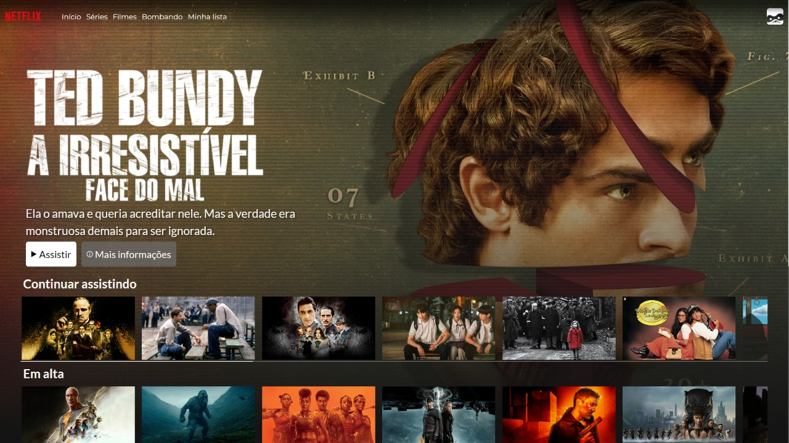

<h1 align="center">
  Netflix Clone
</h1>

## 💻 Projeto
Um Clone da página inicial da Netflix. A finalidade desse projeto é praticar HTML, CSS e Javascript tentando replicar uma interface real.

## 🔨 Implementações

- [X] Consumo de dados da API [The Movie Database](https://developers.themoviedb.org/3)
- [X] Mobile First

## ✨ Tecnologias

- [X] HTML
- [X] CSS
- [X] Media Queries
- [X] Javascript

## 🌐 Deploy
### 💢 Está tendo uma restrição de segurança por causa do nome da empresa! Mas pode confiar que é seguro. 
[Link do Deploy](https://netflix-clone-phmc99.vercel.app/)
